<picture>
  <source media="(prefers-color-scheme: dark)" srcset="./assets/hero-dark.v11.svg">
  
</picture>

  

<picture>
  <source media="(prefers-color-scheme: dark)" srcset="./assets/label-about-dark.v11.svg">
  
</picture>

I'm a full-stack developer with **6+ years** of experience building modern web applications and frontend systems that scale. My focus is the JavaScript and TypeScript ecosystem (React, Angular, Node.js), and I take products from architecture and UI design all the way to deployment.

I care about clean, maintainable interfaces, performance, and reusable UI architecture that grows with the product and the team. I prototype in Figma, so the design and the code come from the same hands.

Today I'm a **Senior Frontend Developer at Urchin Systems**, building microfrontends and a white-label AI widget for **Plextera**. Before that, at **S&T Mold**, I built government systems for the **Customs Service of Moldova**.

  

<picture>
  <source media="(prefers-color-scheme: dark)" srcset="./assets/label-experience-dark.v11.svg">
  
</picture>

<picture>
  <source media="(prefers-color-scheme: dark)" srcset="./assets/experience-dark.v11.svg">
  
</picture>

  

<picture>
  <source media="(prefers-color-scheme: dark)" srcset="./assets/label-projects-dark.v11.svg">
  
</picture>

<a href="https://www.movesflow.it/en">
<picture>
  <source media="(prefers-color-scheme: dark)" srcset="./assets/project-movesflow-dark.v11.svg">
  
</picture>
</a>
<a href="https://plextera.com/">
<picture>
  <source media="(prefers-color-scheme: dark)" srcset="./assets/project-plextera-dark.v11.svg">
  
</picture>
</a>
<picture>
  <source media="(prefers-color-scheme: dark)" srcset="./assets/project-frontiera-dark.v11.svg">
  
</picture>
<a href="https://ecustoms.trade.gov.md/">
<picture>
  <source media="(prefers-color-scheme: dark)" srcset="./assets/project-ecustoms-dark.v11.svg">
  
</picture>
</a>

<b>Other notable work</b>

 

| Project | Where | Role |
| --- | --- | --- |
| **E-Bursa**: freight exchange connecting carriers, shippers and brokers | S&T Mold | Frontend, mobile, UI/UX |
| **[Voucher for professional training](https://voucher.anofm.md/)**: course enrolment for job seekers | S&T Mold | Frontend, UI/UX |
| **[S&T Moldova app](https://www.snt.md/)**: company news, projects and partners | S&T Mold | Full stack, UI/UX |
| **[OCR Gateway](https://ocrgateway.com/)**: OCR and document data extraction | Urchin Systems | Frontend |
| **[Xpedite Permits](https://xpmaps.com/)**: oversize and overweight permits in the US | Minicode | Frontend |
| **[Mirri](https://mirri.md/)**, **[Angro](https://angro.md/)**, **[NeoComputer](https://neocomputer.md/)**, **[Lea Lea Brand](https://lealeabrand.com/)**: online shops | Minicode | Frontend |

  

<picture>
  <source media="(prefers-color-scheme: dark)" srcset="./assets/label-knowledge-dark.v11.svg">
  
</picture>

<picture>
  <source media="(prefers-color-scheme: dark)" srcset="./assets/knowledge-dark.v11.svg">
  
</picture>

  

<picture>
  <source media="(prefers-color-scheme: dark)" srcset="./assets/label-beyond-dark.v11.svg">
  
</picture>

<picture>
  <source media="(prefers-color-scheme: dark)" srcset="./assets/beyond-dark.v11.svg">
  
</picture>

  

<picture>
  <source media="(prefers-color-scheme: dark)" srcset="./assets/label-work-dark.v11.svg">
  
</picture>

**[MovesFlow](https://movesflow.it)** is a personal project of mine: an operations app for moving companies. I designed it myself and built it end to end, with a React front end, a Spring Boot API and a React Native app.

<a href="https://movesflow.it">
<picture>
  <source media="(prefers-color-scheme: dark)" srcset="./assets/movesflow-board-dark.v11.svg">
  
</picture>
</a>

  

<picture>
  <source media="(prefers-color-scheme: dark)" srcset="./assets/label-contact-dark.v11.svg">
  
</picture>

**[LinkedIn](https://www.linkedin.com/in/%C8%99eremet-denis-530893250/)** &nbsp;·&nbsp; **[movesflow.it](https://movesflow.it)** &nbsp;·&nbsp; Happy to talk about UI, design systems and frontend architecture.

 

<picture>
  <source media="(prefers-color-scheme: dark)" srcset="./assets/footer-dark.v11.svg">
  
</picture>
