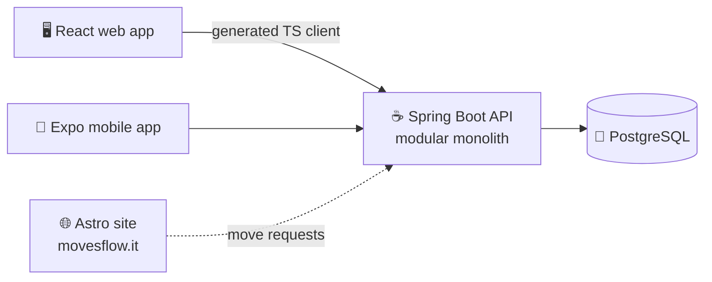
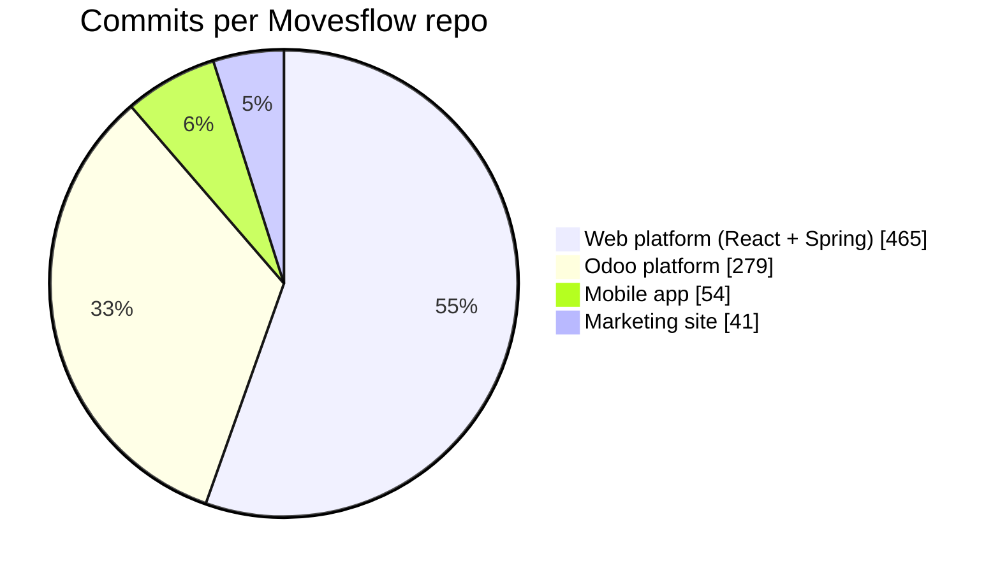

<div align="center">


<a href="https://www.linkedin.com/in/%C8%99eremet-denis-530893250/"></a>


</div>

---

### 👨‍💻 About me

```ts
const denis = {
  role:       "Senior Frontend Developer & UI/UX Designer",
  company:    "Urchin Systems",
  building:   "Movesflow — SaaS for moving companies 🚚",
  focus:      ["React", "TypeScript", "Design systems", "UX that feels fast"],
  alsoBuild:  ["Spring Boot APIs", "React Native apps", "Odoo modules", "3D in Blender"],
  designTools:["Figma", "Photoshop", "Illustrator", "After Effects"],
  funFact:    "I'll redesign the button before I write the onClick 😄",
};
```

### 🧰 Tech stack

<table>
  <tr>
    <td align="center" width="170"><b>🎨 Frontend</b></td>
    <td></td>
  </tr>
  <tr>
    <td align="center"><b>🛠️ Tooling</b></td>
    <td></td>
  </tr>
  <tr>
    <td align="center"><b>⚙️ Backend</b></td>
    <td></td>
  </tr>
  <tr>
    <td align="center"><b>🗄️ Databases</b></td>
    <td></td>
  </tr>
  <tr>
    <td align="center"><b>🖌️ Design</b></td>
    <td></td>
  </tr>
  <tr>
    <td align="center"><b>📱 Mobile & Games</b></td>
    <td></td>
  </tr>
  <tr>
    <td align="center"><b>🔌 Also tinkered with</b></td>
    <td></td>
  </tr>
  <tr>
    <td align="center"><b>💻 Editors</b></td>
    <td></td>
  </tr>
</table>

### 🚚 Movesflow — my main project

<a href="https://movesflow.it"></a>

**Movesflow** is an operations platform for moving companies: orders, dispatch, scheduling, fleet, chat, pricing and invoicing, all in one place. It started on Odoo, and I'm now rebuilding it as a modern React + Spring Boot product with a companion mobile app for drivers and managers.

<table>
  <tr>
    <td width="50%" valign="top">
      <h4>🖥️ Web platform</h4>
      Multi-tenant SPA + API monorepo<br/><br/>
      
      
      
      
      <br/>
      
      
      
      
      
    </td>
    <td width="50%" valign="top">
      <h4>📱 Mobile app</h4>
      Internal app for drivers and managers: orders, chat, push notifications, proof-of-delivery photos<br/><br/>
      
      
      
      
    </td>
  </tr>
  <tr>
    <td width="50%" valign="top">
      <h4>🌐 Marketing site</h4>
      Italian landing site for <a href="https://movesflow.it">movesflow.it</a><br/><br/>
      
      
      
    </td>
    <td width="50%" valign="top">
      <h4>🧩 Odoo platform (v1)</h4>
      The original Movesflow, built as custom Odoo 19 modules<br/><br/>
      
      
      
    </td>
  </tr>
</table>

<details>
<summary><b>🏗️ How it fits together</b> (click to expand)</summary>



**API modules:** orders · scheduling · dispatch & fleet · chat · notifications · pricing · billing · accounting · surveys · multi-tenant auth

</details>

<details>
<summary><b>📈 Commits so far</b> (click to expand)</summary>



</details>

### 📌 Featured projects

<div align="center">

<a href="https://github.com/ssdeniss/Antd-Components"></a>
<a href="https://github.com/ssdeniss/Headphones-Market-NextJS"></a>
<a href="https://github.com/ssdeniss/Github-API"></a>
<a href="https://github.com/ssdeniss/Java-React-App"></a>

</div>

### 📊 GitHub stats

<div align="center">


</div>

<div align="center">


</div>
