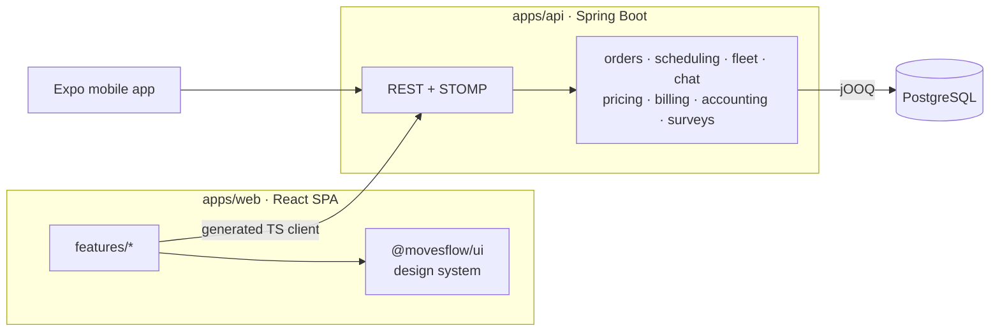

<picture>
  <source media="(prefers-color-scheme: dark)" srcset="./assets/hero-dark.svg?v=2">
  
</picture>

  

<picture>
  <source media="(prefers-color-scheme: dark)" srcset="./assets/label-about-dark.svg?v=2">
  
</picture>

I design and build interfaces, usually both at once. At **Urchin Systems** I work on **Plextera**, a document-intelligence and automation platform: its studio, its document-insights tools, its forms and its OCR gateway.

Outside of that I'm building **[MovesFlow](https://movesflow.it)** end to end, from product design and the React front end to the Spring Boot API and the mobile app.

I care about three things: interfaces that *feel* fast, design systems that keep a product honest, and type-safe contracts between the UI and the API.

 

<picture>
  <source media="(prefers-color-scheme: dark)" srcset="./assets/label-work-dark.svg?v=2">
  
</picture>

#### [movesflow.it](https://movesflow.it) — operations SaaS for moving companies

Requests, surveys, quotes, orders, crews, vehicles, payments and invoices in one system. It replaces the spreadsheets and WhatsApp threads moving companies run on today. It's a multi-tenant React + Spring Boot monorepo, rebuilt from scratch to replace the first Odoo version.

<a href="https://movesflow.it">
<picture>
  <source media="(prefers-color-scheme: dark)" srcset="./assets/movesflow-board-dark.svg?v=2">
  
</picture>
</a>

<picture>
  <source media="(prefers-color-scheme: dark)" srcset="./assets/movesflow-stats-dark.svg?v=2">
  
</picture>

**Front end** React 19, TypeScript, Vite, TanStack Router + Query, React Hook Form + Zod, MUI, i18next 
**Back end** Java, Spring Boot (modular monolith), jOOQ, Flyway, PostgreSQL, WebSocket + STOMP chat 
**Quality** Vitest, Testing Library, MSW, Playwright, JUnit, Testcontainers, OpenAPI-generated client

<b>How it's put together</b>

 

- **Contract-first.** The OpenAPI spec generates the TypeScript client, so UI and API types can't drift apart.
- **Layered modules.** Each backend module splits into `api / application / domain / infrastructure`.
- **One design system.** Shared components live in `packages/ui`, so features never build their own buttons.

 

<picture>
  <source media="(prefers-color-scheme: dark)" srcset="./assets/movesflow-ecosystem-dark.svg?v=2">
  
</picture>

  

<picture>
  <source media="(prefers-color-scheme: dark)" srcset="./assets/label-toolkit-dark.svg?v=2">
  
</picture>

<picture>
  <source media="(prefers-color-scheme: dark)" srcset="./assets/toolkit-dark.svg?v=2">
  
</picture>

  

<picture>
  <source media="(prefers-color-scheme: dark)" srcset="./assets/label-contact-dark.svg?v=2">
  
</picture>

**[movesflow.it](https://movesflow.it)** &nbsp;·&nbsp; **[LinkedIn](https://www.linkedin.com/in/%C8%99eremet-denis-530893250/)** &nbsp;·&nbsp; Open to talking about UI, design systems and product engineering.

 

<picture>
  <source media="(prefers-color-scheme: dark)" srcset="./assets/footer-dark.svg?v=2">
  
</picture>
