<picture>
  <source media="(prefers-color-scheme: dark)" srcset="./assets/hero-dark.v5.svg">
  
</picture>

  

<picture>
  <source media="(prefers-color-scheme: dark)" srcset="./assets/label-about-dark.v5.svg">
  
</picture>

I'm a frontend developer and UI/UX designer who works across the whole stack. I design in Figma and ship in TypeScript, and I care most about the details in between: spacing, motion, and interfaces that *feel* fast.

At **Urchin Systems** I build the web apps behind **Plextera**, a document-intelligence and automation platform. That includes its studio, its document-insights tools, its forms and its OCR gateway, built with React, Next.js, Redux and Angular.

 

<picture>
  <source media="(prefers-color-scheme: dark)" srcset="./assets/label-knowledge-dark.v5.svg">
  
</picture>

<picture>
  <source media="(prefers-color-scheme: dark)" srcset="./assets/knowledge-dark.v5.svg">
  
</picture>

  

<picture>
  <source media="(prefers-color-scheme: dark)" srcset="./assets/label-work-dark.v5.svg">
  
</picture>

**[MovesFlow](https://movesflow.it)** is a personal project of mine: an operations app for moving companies. I designed it myself and built it end to end, with a React front end, a Spring Boot API and a React Native app.

<a href="https://movesflow.it">
<picture>
  <source media="(prefers-color-scheme: dark)" srcset="./assets/movesflow-board-dark.v5.svg">
  
</picture>
</a>

  

<picture>
  <source media="(prefers-color-scheme: dark)" srcset="./assets/label-contact-dark.v5.svg">
  
</picture>

**[LinkedIn](https://www.linkedin.com/in/%C8%99eremet-denis-530893250/)** &nbsp;·&nbsp; **[movesflow.it](https://movesflow.it)** &nbsp;·&nbsp; Happy to talk about UI, design systems and frontend architecture.

 

<picture>
  <source media="(prefers-color-scheme: dark)" srcset="./assets/footer-dark.v5.svg">
  
</picture>
