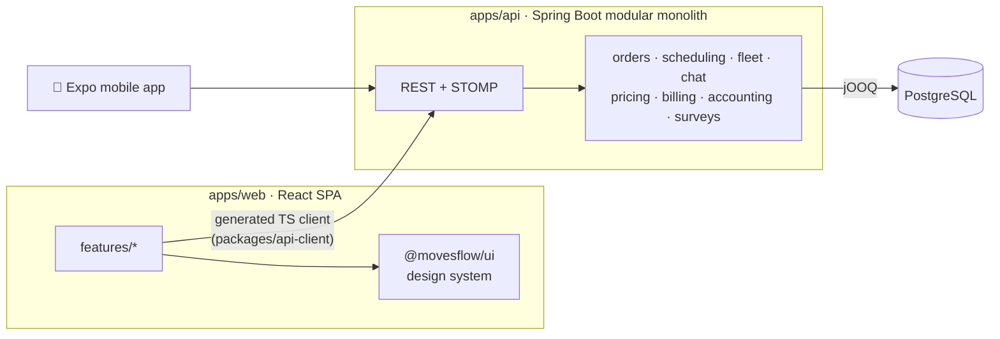

<div align="center">


<a href="https://www.linkedin.com/in/%C8%99eremet-denis-530893250/"></a>


</div>

---

### 👨‍💻 About me

```ts
const denis = {
  role:       "Senior Frontend Developer & UI/UX Designer",
  company:    "Urchin Systems",
  building:   "Movesflow — SaaS for moving companies 🚚",
  focus:      ["React", "TypeScript", "Design systems", "UX that feels fast"],
  alsoBuild:  ["Spring Boot APIs", "React Native apps", "Odoo modules", "3D in Blender"],
  designTools:["Figma", "Photoshop", "Illustrator", "After Effects"],
  funFact:    "I'll redesign the button before I write the onClick 😄",
};
```

### 🧰 Tech stack

<table>
  <tr>
    <td align="center" width="170"><b>🎨 Frontend</b></td>
    <td></td>
  </tr>
  <tr>
    <td align="center"><b>🛠️ Tooling</b></td>
    <td></td>
  </tr>
  <tr>
    <td align="center"><b>⚙️ Backend</b></td>
    <td></td>
  </tr>
  <tr>
    <td align="center"><b>🗄️ Databases</b></td>
    <td></td>
  </tr>
  <tr>
    <td align="center"><b>🖌️ Design</b></td>
    <td></td>
  </tr>
  <tr>
    <td align="center"><b>📱 Mobile & Games</b></td>
    <td></td>
  </tr>
  <tr>
    <td align="center"><b>🔌 Also tinkered with</b></td>
    <td></td>
  </tr>
  <tr>
    <td align="center"><b>💻 Editors</b></td>
    <td></td>
  </tr>
</table>

### 🚚 Main project — Movesflow

<a href="https://movesflow.it"></a>

**Movesflow** is a multi-tenant SaaS platform for moving companies. It covers the whole job, from the first customer request to the final invoice. I'm building it as a React + Spring Boot monorepo, rebuilt from scratch to replace an earlier Odoo version.

<table>
  <tr>
    <td valign="top" width="58%">
      <h4>✨ What it does</h4>
      📦 <b>Orders and move requests</b> from public forms to job board<br/>
      🗓️ <b>Scheduling and calendar</b> for crews and jobs<br/>
      🚛 <b>Fleet and service regions</b><br/>
      💬 <b>Real-time chat</b> with staff and clients (WebSocket + STOMP)<br/>
      🧾 <b>Pricing, billing and accounting</b><br/>
      📋 <b>On-site surveys</b><br/>
      🔔 <b>Notifications</b> and a live <b>dashboard</b><br/>
      🏢 <b>Multi-tenant</b> company settings, roles and users
    </td>
    <td valign="top" width="42%">
      <h4>🧱 Built with</h4>
      <b>Frontend</b><br/>
      
      
      
      
      
      
      <br/>
      <b>Backend</b><br/>
      
      
      
      
      
      <br/>
      <b>Quality and ops</b><br/>
      
      
      
      
      
    </td>
  </tr>
</table>

<div align="center">


</div>

<details>
<summary><b>🏗️ Architecture</b> (click to expand)</summary>



- **Contract-first:** the backend's OpenAPI spec generates the TypeScript client, so frontend and API types never drift apart.
- **Layered modules:** each backend module is split into `api / application / domain / infrastructure`.
- **Shared design system:** buttons, cards and menus live in `packages/ui`, so features don't each build their own.

</details>

#### 🧩 Around it

| | Project | Stack |
| --- | --- | --- |
| 📱 | **Mobile app**: internal app for drivers and managers, with orders, chat, push notifications and proof-of-delivery photos | React Native · Expo · Zustand · TanStack Query |
| 🌐 | **Marketing site**: [movesflow.it](https://movesflow.it), the Italian landing site | Astro · TypeScript · Docker |
| 🧩 | **Odoo v1**: the original platform, built as custom Odoo 19 modules | Odoo · Python · Docker |

### 📌 Public repos

<div align="center">

<a href="https://github.com/ssdeniss/Antd-Components"></a>
<a href="https://github.com/ssdeniss/Headphones-Market-NextJS"></a>
<a href="https://github.com/ssdeniss/Github-API"></a>
<a href="https://github.com/ssdeniss/Java-React-App"></a>

</div>

### 📊 GitHub stats

<div align="center">


</div>

<div align="center">


</div>
