<picture>
  <source media="(prefers-color-scheme: dark)" srcset="./assets/hero-dark.v6.svg">
  
</picture>

  

<picture>
  <source media="(prefers-color-scheme: dark)" srcset="./assets/label-about-dark.v6.svg">
  
</picture>

I'm a full-stack developer with **6+ years** of experience building modern web applications and frontend systems that scale. My focus is the JavaScript and TypeScript ecosystem (React, Angular, Node.js), and I take products from architecture and UI design all the way to deployment.

I care about clean, maintainable interfaces, performance, and reusable UI architecture that grows with the product and the team. I prototype in Figma, so the design and the code come from the same hands.

Currently a **Senior Frontend Developer at Urchin Systems**, building **Plextera** and **OCR Gateway**.

 

<picture>
  <source media="(prefers-color-scheme: dark)" srcset="./assets/label-knowledge-dark.v6.svg">
  
</picture>

<picture>
  <source media="(prefers-color-scheme: dark)" srcset="./assets/knowledge-dark.v6.svg">
  
</picture>

  

<picture>
  <source media="(prefers-color-scheme: dark)" srcset="./assets/label-projects-dark.v6.svg">
  
</picture>

<a href="https://plextera.com/">
<picture>
  <source media="(prefers-color-scheme: dark)" srcset="./assets/project-plextera-dark.v6.svg">
  
</picture>
</a>
<a href="https://ocrgateway.com/">
<picture>
  <source media="(prefers-color-scheme: dark)" srcset="./assets/project-ocrgateway-dark.v6.svg">
  
</picture>
</a>
<a href="https://www.movesflow.it/en">
<picture>
  <source media="(prefers-color-scheme: dark)" srcset="./assets/project-movesflow-dark.v6.svg">
  
</picture>
</a>
<a href="https://xpeditepermits.com/">
<picture>
  <source media="(prefers-color-scheme: dark)" srcset="./assets/project-xpedite-dark.v6.svg">
  
</picture>
</a>
<a href="https://angro.md/">
<picture>
  <source media="(prefers-color-scheme: dark)" srcset="./assets/project-angro-dark.v6.svg">
  
</picture>
</a>
<a href="https://neocomputer.md/ru/service">
<picture>
  <source media="(prefers-color-scheme: dark)" srcset="./assets/project-neocomputer-dark.v6.svg">
  
</picture>
</a>

  

<picture>
  <source media="(prefers-color-scheme: dark)" srcset="./assets/label-work-dark.v6.svg">
  
</picture>

**[MovesFlow](https://movesflow.it)** is a personal project of mine: an operations app for moving companies. I designed it myself and built it end to end, with a React front end, a Spring Boot API and a React Native app.

<a href="https://movesflow.it">
<picture>
  <source media="(prefers-color-scheme: dark)" srcset="./assets/movesflow-board-dark.v6.svg">
  
</picture>
</a>

  

<picture>
  <source media="(prefers-color-scheme: dark)" srcset="./assets/label-contact-dark.v6.svg">
  
</picture>

**[LinkedIn](https://www.linkedin.com/in/%C8%99eremet-denis-530893250/)** &nbsp;·&nbsp; **[movesflow.it](https://movesflow.it)** &nbsp;·&nbsp; Happy to talk about UI, design systems and frontend architecture.

 

<picture>
  <source media="(prefers-color-scheme: dark)" srcset="./assets/footer-dark.v6.svg">
  
</picture>
